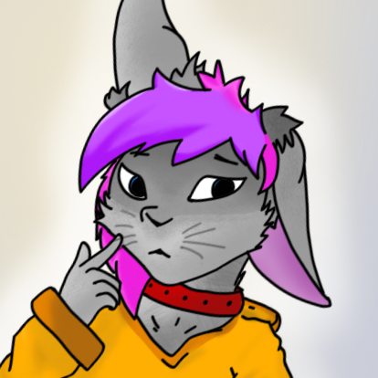
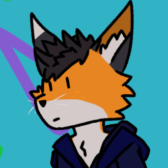

# discord-bun-bot-public 🐰🦊🐾

 

» "hai! i'm bun, a sfw furry bot! 🐰🐾" 
» "hewwo! i'm fox kit! 🦊🐾" 

---

### this page is intended for the following bots:
› **`discord-bun-bot`**
 
› **`discord-fox-kit-bot`**

---

› `bun 🐰🐾`'s [terms of service](https://magicalbunny31.github.io/discord-bun-bot-public/bun/terms-of-service "https://magicalbunny31.github.io/discord-bun-bot-public/bun/terms-of-service 🔗")
 
› `bun 🐰🐾`'s [privacy policy](https://magicalbunny31.github.io/discord-bun-bot-public/bun/privacy-policy "https://magicalbunny31.github.io/discord-bun-bot-public/bun/privacy-policy 🔗")
 
› `fox kit 🦊🐾`'s [terms of service](https://magicalbunny31.github.io/discord-bun-bot-public/fox-kit/terms-of-service "https://magicalbunny31.github.io/discord-bun-bot-public/fox-kit/terms-of-service 🔗")
 
› `fox kit 🦊🐾`'s [privacy policy](https://magicalbunny31.github.io/discord-bun-bot-public/fox-kit/privacy-policy "https://magicalbunny31.github.io/discord-bun-bot-public/fox-kit/privacy-policy 🔗")

---

› this repository exists as a landing page for points of contact with **`bun 🐰🐾`** and **`fox-kit 🦊🐾`**
 
› need to contact me about something?
 
› - open an [issue](https://github.com/magicalbunny31/discord-bun-bot-public/issues/new "open an issue 🐾")!

---

› made by [magicalbunny31](https://magicalbunny31.github.io "https://magicalbunny31.github.io 🔗
magicalbunny31's website 🐾") 2019/2020 - 2022 🐾
